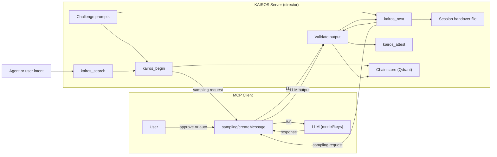

> **Note:** This document describes a goal-state design decision. As of
> March 2026, MCP client sampling integration is not yet implemented.

# Target architecture (goal state)

This document describes the architecture **after** kairos-mcp is extended
with MCP client sampling. The KAIROS server acts as a **director**: it
defines exact challenge prompts, requests LLM execution through the client
via sampling, and validates structured output before advancing the
protocol. The client keeps control of models and API keys; the server
never calls an LLM directly.

## Roles

| Role | Responsibility |
|------|----------------|
| **KAIROS server (director)** | Stores protocol chains, issues challenges, builds sampling requests with fixed prompts, validates LLM output, advances state (begin/next/attest), optional session handover. |
| **MCP client** | Receives sampling requests from the server, runs the LLM (user approves or auto), returns the LLM response to the server. Owns model choice and API keys. |
| **User** | Approves or edits prompts when approval is required; can allow auto-sampling for trusted servers so most steps run without attention. |

## High-level flow

1. The user (or agent) starts a protocol run via `kairos_search` and
   `kairos_begin` as today.
2. For each step, the server holds a **challenge** (for example, resolve
   participants, find slot, create event). Instead of the agent guessing
   how to satisfy it, the server:
   - Builds a **sampling request** with a fixed system and user prompt
     that tells the LLM exactly what to do.
   - Sends that request to the **client** over MCP.
3. The client runs the LLM (after user approval or automatically if
   policy allows) and returns the LLM output to the server.
4. The server **validates** the output (for example, JSON shape, required
   fields), then treats it as the solution for that step and advances.
5. When all steps are done, the run finalizes with `kairos_attest` as
   today.

The server may optionally write a **session handover file** so the run
can be resumed after a client restart or switch.

## Component diagram

```mermaid
flowchart LR
    subgraph client ["MCP Client"]
        User["User"]
        LLM["LLM (model/keys)"]
        Sampling["sampling/createMessage"]
        User -->|"approve or auto"| Sampling
        Sampling -->|"run"| LLM
        LLM -->|"response"| Sampling
    end

    subgraph server ["KAIROS Server (director)"]
        Search["kairos_search"]
        Begin["kairos_begin"]
        Next["kairos_next"]
        Attest["kairos_attest"]
        Prompts["Challenge prompts"]
        Validate["Validate output"]
        Store["Chain store (Qdrant)"]
        Handover["Session handover file"]
        Prompts --> Begin
        Prompts --> Next
        Begin --> Store
        Next --> Validate
        Validate --> Store
        Next --> Handover
    end

    Agent["Agent or user intent"] --> Search
    Search --> Begin
    Begin -->|"sampling request"| Sampling
    Sampling -->|"LLM output"| Validate
    Validate --> Next
    Next -->|"sampling request"| Sampling
    Sampling -->|"LLM output"| Validate
    Validate --> Attest
```

- **Agent or user intent** triggers search and begin; the agent calls
  `kairos_begin` / `kairos_next` with URIs. For sampling steps, the
  server issues the sampling request and the client returns LLM output;
  the server validates and advances. The exact protocol (whether the
  agent invokes a "solve via sampling" tool or the server blocks on
  sampling inside begin/next) belongs to the implementation plan.
- **Challenge prompts** are the fixed system/user messages the server
  sends so the LLM does not guess how to solve the step.
- **Session handover file** is optional and written by the server for
  resumability.

## Data flow (sampling step)

1. The server has the current step and challenge (for example,
   "resolve_participants"). It builds:
   - `messages`: system message with exact instructions plus user message
     with input.
   - `temperature`, `top_p`, optional `approvalMode: "auto"`.
2. The server sends `sampling/createMessage(messages, temperature, top_p,
   approvalMode?)` to the client.
3. The client shows the prompt to the user (or skips if auto), runs the
   LLM, and returns the response.
4. The server parses and validates the response. On success: use as
   solution, advance to next step, return `next_action` (and optional
   `proof_hash`) to the agent. On failure: return error and retry
   instructions.

## What stays the same

- **Protocol chain model:** H1 protocol, H2 steps, stored in Qdrant.
  `kairos_mint`, `kairos_update`, and `kairos_delete` are unchanged.
- **Search:** `kairos_search` returns choices and per-choice
  `next_action`; the agent picks one and calls `kairos_begin`.
- **Attestation:** `kairos_attest` finalizes the run.
- **Challenge types:** shell, mcp, user_input, comment remain valid. For
  sampling steps, the server translates the challenge into a sampling
  prompt and validates the LLM output.

## What is new

- **Sampling integration:** The server can request LLM execution via the
  client using `sampling/createMessage` with server-defined prompts.
- **Server-side validation:** The server validates LLM output before
  advancing; no advance on validation failure.
- **Approval modes:** Per-step or per-request `approvalMode`: user
  approval vs `"auto"` when client policy allows.
- **Session handover:** Optional file with `SESSION_ID`,
  `current_challenge`, and partial state for resumability.

## Out of scope for this document

- Implementation details (which tool or RPC triggers sampling, how
  `kairos_begin` / `kairos_next` responses change at the wire level).
- Migration path from current behavior.
- Exact schema of `sampling/createMessage` (see
  [02-workflow-sampling.md](02-workflow-sampling.md)).

## See also

- [02-workflow-sampling.md](02-workflow-sampling.md) — sampling sequence
  and approval modes
- [../architecture/README.md](../architecture/README.md) — current
  behavior
