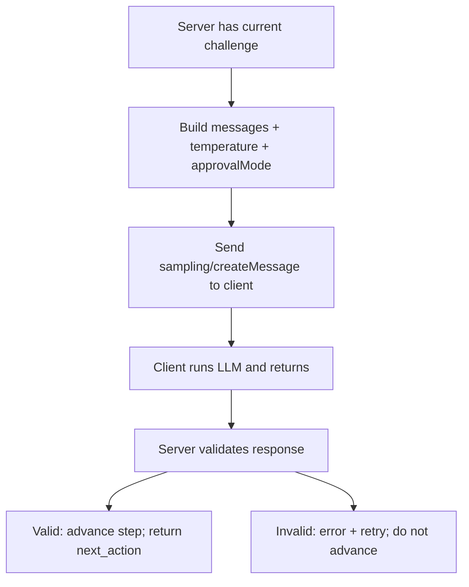

# Sampling workflow (goal state)

This document describes how the KAIROS server uses MCP client sampling to have the client run an LLM with a **fixed challenge prompt**. The server never calls the LLM directly; the client owns models and API keys and can require user approval or run automatically when policy allows.

---

## MCP client sampling (reference)

The MCP `/client/sampling` spec allows **servers** to request LLM calls through the **client**:

- **Server → Client:** e.g. `sampling/createMessage(messages, temperature=0.2, top_p=0.9, approvalMode?)`
- **Client:** Presents the prompt to the user (or skips if `approvalMode: "auto"` and policy allows), runs the LLM, returns the result to the server.
- **User** stays in control: they approve or edit prompts when approval is required; for trusted servers they can allow auto-sampling so most steps run without attention.

---

## Sequence: one sampling step

```mermaid
sequenceDiagram
    participant Server as KAIROS Server
    participant Client as MCP Client
    participant User as User
    participant LLM as LLM

    Server->>Server: Build challenge prompt (system + user)
    Server->>Client: sampling/createMessage(messages, temperature, top_p, approvalMode)
    alt approvalMode is user or default
        Client->>User: Show prompt
        User->>Client: Approve or edit
    else approvalMode is auto and policy allows
        Client->>Client: Skip user approval
    end
    Client->>LLM: Run with messages
    LLM->>Client: Response (e.g. JSON text)
    Client->>Server: Return response
    Server->>Server: Validate (e.g. JSON shape)
    alt valid
        Server->>Server: Advance step; build next_action
    else invalid
        Server->>Server: Error; do not advance; retry instructions
    end
```

1. **Server** has the current step and challenge (e.g. “resolve_participants”). It builds:
   - `messages`: e.g. system message with exact instructions (“Call MCP-Calendar.find_user_by_name() for each. Return JSON.”) and user message with input (“Resolve: Adam, Betty, Candy”).
   - `temperature`, `top_p` (e.g. 0.2 for deterministic, 0.9 for creative).
   - Optional `approvalMode: "auto"` for background steps.
2. **Server** sends **sampling/createMessage** to the **client**.
3. **Client** either shows the prompt to the **user** (for approval/edit) or, if `approvalMode: "auto"` and client policy allows (e.g. `allowAutoSampling: ["kairos-mcp"]`), runs without user attention.
4. **Client** calls the **LLM** and returns the raw or structured response to the **server**.
5. **Server** validates the response (e.g. parse JSON, check required fields). On success it advances the protocol (e.g. next step or attest); on failure it returns an error and does not advance.

---

## Approval modes

| Mode | Meaning | Typical use in KAIROS |
|------|---------|------------------------|
| **User (default)** | Client shows the prompt; user must approve or edit before the LLM runs. | Safety-sensitive steps (e.g. create_event, confirm payment). |
| **Auto** | Client runs the LLM without user approval if policy allows. | Low-risk steps (resolve names, find slots, format output). |

Clients can restrict auto-sampling by policy, e.g. only allow it for specific server names: `allowAutoSampling: ["kairos-mcp"]`. Then most KAIROS steps (resolve, find_slot, etc.) can run in the background and only the final “create” or “confirm” step requires user approval.

---

## Flowchart: server decision



---

## What the server sends (conceptual)

- **messages:** Array of message objects, e.g.:
  - `{ role: "system", content: "Challenge 1: Call MCP-Calendar.find_user_by_name() for each name. Return a JSON object: { \"resolved\": { \"DisplayName\": \"email_or_null\" } }." }`
  - `{ role: "user", content: "Resolve: Adam, Betty, Candy" }`
- **temperature / top_p:** Chosen per step (e.g. 0.2 for structured output).
- **approvalMode:** `"auto"` for non-sensitive steps when the client allows it; omit or `"user"` for steps that must show the prompt to the user.

Exact parameter names and shapes follow the MCP client sampling specification; this is the conceptual content.

---

## What the server receives and validates

- **From client:** The LLM output (e.g. a string that should be valid JSON).
- **Validation:** Parse JSON (if expected), check required keys (e.g. `resolved`), optional type checks. If validation fails, the server does not advance and returns a clear error and retry instructions to the agent/client.
- **Optional — output files:** For steps that produce or change files, the server can verify outcomes using [MCP client roots](https://modelcontextprotocol.io/specification/2025-11-25/client/roots): request `roots/list` to get `file://` URIs the client exposes, then read or list within those roots to confirm expected files exist or match expectations.

---

## Out of scope

- Wire-level schema of `sampling/createMessage` (defined by MCP spec).
- How kairos_begin/kairos_next expose this (sync vs async, new tool vs extended response); that belongs to the implementation plan.
