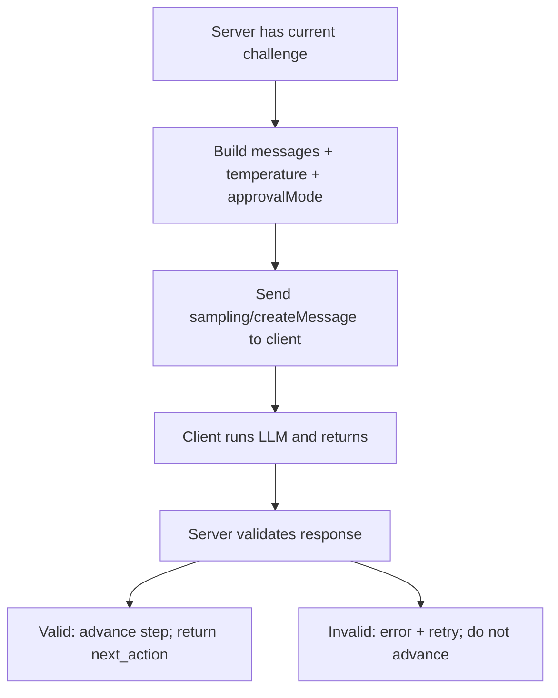

> **Note:** This document describes a goal-state design decision. As of
> March 2026, MCP client sampling integration is not yet implemented.

# Sampling workflow (goal state)

This document describes how the KAIROS server uses MCP client sampling to
have the client run an LLM with a **fixed challenge prompt**. The server
never calls the LLM directly; the client owns models and API keys and can
require user approval or run automatically when policy allows.

## MCP client sampling reference

The MCP `/client/sampling` spec lets **servers** request LLM calls
through the **client**:

- **Server → Client:** `sampling/createMessage(messages, temperature,
  top_p, approvalMode?)`
- **Client:** Presents the prompt to the user (or skips if
  `approvalMode: "auto"` and policy allows), runs the LLM, returns the
  result to the server.
- **User** stays in control: they approve or edit prompts when required;
  for trusted servers they can allow auto-sampling.

## Sequence: one sampling step

```mermaid
sequenceDiagram
    participant Server as KAIROS Server
    participant Client as MCP Client
    participant User as User
    participant LLM as LLM

    Server->>Server: Build challenge prompt (system + user)
    Server->>Client: sampling/createMessage(messages, temperature, top_p, approvalMode)
    alt approvalMode is user or default
        Client->>User: Show prompt
        User->>Client: Approve or edit
    else approvalMode is auto and policy allows
        Client->>Client: Skip user approval
    end
    Client->>LLM: Run with messages
    LLM->>Client: Response (for example, JSON text)
    Client->>Server: Return response
    Server->>Server: Validate (for example, JSON shape)
    alt valid
        Server->>Server: Advance step; build next_action
    else invalid
        Server->>Server: Error; do not advance; retry instructions
    end
```

1. The server has the current step and challenge. It builds:
   - `messages`: system message with exact instructions and user message
     with input.
   - `temperature`, `top_p` (for example, 0.2 for deterministic output).
   - Optional `approvalMode: "auto"` for background steps.
2. The server sends `sampling/createMessage` to the client.
3. The client either shows the prompt to the user (for approval or edit)
   or, if `approvalMode: "auto"` and client policy allows, runs without
   user attention.
4. The client calls the LLM and returns the response to the server.
5. The server validates the response (for example, parse JSON, check
   required fields). On success it advances the protocol; on failure it
   returns an error without advancing.

## Approval modes

| Mode | Meaning | Typical use in KAIROS |
|------|---------|------------------------|
| **User (default)** | Client shows the prompt; user must approve or edit before the LLM runs. | Safety-sensitive steps (for example, create_event, confirm payment). |
| **Auto** | Client runs the LLM without user approval if policy allows. | Low-risk steps (resolve names, find slots, format output). |

Clients can restrict auto-sampling by policy, for example:
`allowAutoSampling: ["kairos-mcp"]`. Steps like resolve, find_slot, and
format can then run in the background; only the final "create" or
"confirm" step requires user approval.

## Server decision flowchart

```mermaid
flowchart TD
    Start["Server has current challenge"]
    Build["Build messages + temperature + approvalMode"]
    Send["Send sampling/createMessage to client"]
    Wait["Client runs LLM and returns"]
    Validate["Server validates response"]
    Ok["Valid: advance step; return next_action"]
    Fail["Invalid: error + retry; do not advance"]

    Start --> Build
    Build --> Send
    Send --> Wait
    Wait --> Validate
    Validate --> Ok
    Validate --> Fail
```

## What the server sends

- **messages:** Array of message objects, for example:
  - `{ role: "system", content: "Challenge 1: Call
    MCP-Calendar.find_user_by_name() for each name. Return a JSON object:
    { \"resolved\": { \"DisplayName\": \"email_or_null\" } }." }`
  - `{ role: "user", content: "Resolve: Adam, Betty, Candy" }`
- **temperature / top_p:** Chosen per step (for example, 0.2 for
  structured output).
- **approvalMode:** `"auto"` for non-sensitive steps when the client
  allows it; omit or `"user"` for steps that must show the prompt.

Exact parameter names and shapes follow the MCP client sampling
specification; this is the conceptual content.

## What the server receives and validates

- **From client:** The LLM output (for example, a string that must be
  valid JSON).
- **Validation:** Parse JSON (when expected), check required keys,
  optional type checks. On failure the server does not advance and
  returns a clear error with retry instructions.

## Out of scope

- Wire-level schema of `sampling/createMessage` (defined by MCP spec).
- How `kairos_begin` / `kairos_next` expose this at the wire level; that
  belongs to the implementation plan.

## See also

- [01-target-architecture.md](01-target-architecture.md) — component
  diagram and roles
- [05-challenge-prompts-and-policies.md](05-challenge-prompts-and-policies.md)
  — challenge types to prompts; approval mode decisions
