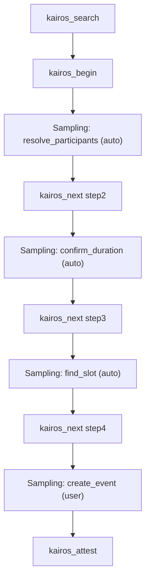

# Full protocol run with sampling (goal state)

This document describes a complete protocol run **after** sampling is integrated: search → begin → solve each step via sampling → next (loop) → attest. It contrasts “before” (agent guesses how to satisfy challenges) with “after” (server sends fixed prompts via sampling and validates output). The style mirrors [../architecture/workflow-full-execution.md](../architecture/workflow-full-execution.md) (call/response) but for the target flow.

---

## Before vs after (conceptual)

**Before (current):** The server returns a challenge (e.g. “resolve_participants”) and a description. The **agent** must figure out how to satisfy it (e.g. call MCP-Calendar tools, then submit a solution). That leads to inconsistent behaviour and wrong assumptions.

**After (goal):** The server **builds a fixed prompt** for the challenge (e.g. “Call MCP-Calendar.find_user_by_name() for each. Return JSON.”) and sends it to the **client** via sampling. The **client** runs the LLM and returns the result. The **server** validates the output (e.g. JSON shape) and only then advances. The agent no longer invents how to solve the step; it follows next_action while the server drives sampling and validation.

---

## Example protocol: calendar appointment

A 4-step “Create calendar appointment” protocol:

1. **Resolve participants** — resolve names “Adam, Betty, Candy” to identities (e.g. emails).
2. **Confirm duration** — ask user for duration (e.g. 30 min default).
3. **Find slot** — find a slot in the next two weeks for all (or 2/3) participants.
4. **Create event** — create the calendar event (safety gate; user approval).

Steps 1–3 are good candidates for **auto** sampling; step 4 uses **user** approval.

---

## Step 0: search (unchanged)

User says: “Create calendar appointment for Adam, Betty, Candy.”

### Call

```json
kairos_search({ "query": "calendar appointment create participants" })
```

### Response (unchanged)

```json
{
  "must_obey": true,
  "message": "Found 1 match.",
  "next_action": "Follow the choice's next_action.",
  "choices": [{
    "uri": "kairos://mem/step1-uuid-...",
    "label": "Resolve participants / Confirm duration / Find slot / Create event",
    "chain_label": "Create calendar appointment",
    "score": 0.85,
    "role": "match",
    "next_action": "call kairos_begin with kairos://mem/step1-uuid-... to execute protocol"
  }]
}
```

Agent follows the choice’s next_action and calls **kairos_begin** with that URI.

---

## Step 1: begin (first step)

### Call

```json
kairos_begin({ "uri": "kairos://mem/step1-uuid-..." })
```

### Response (goal state: server drives sampling)

The server returns the current step and challenge. In the goal state it **also** issues a sampling request (conceptually; the exact mechanism is for the implementation plan). The agent/client sees that the step is to be solved via sampling.

Conceptual server behaviour:

- **Challenge:** resolve_participants; input: “Adam, Betty, Candy”.
- **Sampling request** (to client): `sampling/createMessage(messages, temperature=0.2, top_p=0.9, approvalMode: "auto")` where messages are:
  - System: “Challenge 1: Call MCP-Calendar.find_user_by_name() for each name. Return JSON: { \"resolved\": { \"DisplayName\": \"email_or_null\" } }.”
  - User: “Resolve: Adam, Betty, Candy.”
- **Client** runs LLM, returns e.g. `{"resolved":{"Adam":"adam@co.com","Betty":"betty@co.com","Candy":null}}`.
- **Server** validates JSON and required keys, then advances. Response to agent includes next_action for the next step (e.g. kairos_next with step 2 URI and solution derived from validated output, or a dedicated “step solved” response).

### Next action

Agent’s next_action: call kairos_next with `kairos://mem/step2-uuid-...` and the solution (or the server has already advanced and returns the next step’s challenge; exact wire format is implementation-defined). Flow continues similarly for steps 2 and 3 with sampling; step 4 uses user approval.

---

## Step 2 and 3: next (sampling + auto)

For steps 2 (confirm duration) and 3 (find slot), the same pattern:

- Server returns (or has already used) a sampling request with a **fixed prompt** for that step.
- approvalMode can be **auto** so the client runs without user attention (if policy allows).
- Server validates the LLM output and advances; agent receives next_action to the next step or to attest.

---

## Step 4: next (sampling + user approval)

Step 4 (create event) is a safety gate:

- Server sends sampling request with **approvalMode** requiring user approval (or default).
- Client shows the prompt (e.g. “Create calendar event with these participants and slot”); user approves or edits.
- After LLM runs and server validates, server advances to “protocol complete” and returns next_action: call **kairos_attest** with the chain URI and outcome/message.

---

## Final: attest (unchanged)

### Call

```json
kairos_attest({
  "uri": "kairos://mem/step4-uuid-...",
  "outcome": "success",
  "message": "Calendar event created for Adam, Betty, Candy."
})
```

After attestation, the protocol run is complete. Quality updates can be applied as in the current design (e.g. in kairos_next or in attest).

---

## Flow summary (goal state)

```
search("calendar appointment ...")
  -> choices[0].next_action: call kairos_begin with step1 URI
    |
kairos_begin(step1)
  -> Server issues sampling (resolve_participants); client runs LLM; server validates
  -> next_action: call kairos_next with step2 URI and solution
    |
kairos_next(step2, solution)  [solution from validated sampling output]
  -> Server issues sampling (confirm_duration); auto; validate
  -> next_action: call kairos_next with step3 URI
    |
kairos_next(step3, solution)
  -> Server issues sampling (find_slot); auto; validate
  -> next_action: call kairos_next with step4 URI
    |
kairos_next(step4, solution)
  -> Server issues sampling (create_event); user approval; validate
  -> next_action: call kairos_attest with chain URI
    |
kairos_attest(uri, outcome, message)
  -> Run complete.
```

---

## Diagram: protocol run with sampling



---

## Summary

- **Search and attest** stay as today; **begin** and **next** in the goal state drive sampling for steps that use it.
- The server sends **fixed prompts** via sampling; the client runs the LLM; the server **validates** and only then advances.
- **Auto** vs **user** approval is per step; safety-sensitive steps (e.g. create event) use user approval.
- Exact request/response shapes for “server issues sampling” (e.g. inline in kairos_begin/next vs separate tool) are left to the implementation plan.
