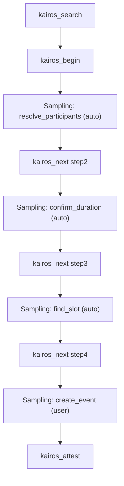

> **Note:** This document describes a goal-state design decision. As of
> March 2026, MCP client sampling integration is not yet implemented.

# Full protocol run with sampling (goal state)

This document describes a complete protocol run **after** sampling is
integrated: search → begin → solve each step via sampling → next (loop)
→ attest. It contrasts the current behavior (agent guesses how to satisfy
challenges) with the target behavior (server sends fixed prompts via
sampling and validates output). The style mirrors
[../architecture/workflow-full-execution.md](../architecture/workflow-full-execution.md)
(call/response) but for the target flow.

## Before vs after (conceptual)

**Before (current):** The server returns a challenge (for example,
"resolve_participants") and a description. The agent must figure out how
to satisfy it (for example, call MCP-Calendar tools, then submit a
solution). That leads to inconsistent behavior and wrong assumptions.

**After (goal):** The server **builds a fixed prompt** for the challenge
(for example, "Call MCP-Calendar.find_user_by_name() for each. Return
JSON.") and sends it to the **client** via sampling. The client runs the
LLM and returns the result. The server validates the output and only then
advances. The agent no longer invents how to solve the step; it follows
`next_action` while the server drives sampling and validation.

## Example protocol: calendar appointment

A 4-step "Create calendar appointment" protocol:

1. **Resolve participants** — resolve "Adam, Betty, Candy" to identities
   (for example, emails).
2. **Confirm duration** — ask the user for duration (for example, 30 min
   default).
3. **Find slot** — find a slot in the next two weeks for all (or 2/3)
   participants.
4. **Create event** — create the calendar event (safety gate; user
   approval).

Steps 1–3 are good candidates for **auto** sampling; step 4 uses
**user** approval.

## Step 0: search (unchanged)

```json
kairos_search({ "query": "calendar appointment create participants" })
```

Response (unchanged):

```json
{
  "must_obey": true,
  "message": "Found 1 match.",
  "next_action": "Follow the choice's next_action.",
  "choices": [{
    "uri": "kairos://mem/step1-uuid-...",
    "label": "Resolve participants / Confirm duration / Find slot / Create event",
    "chain_label": "Create calendar appointment",
    "score": 0.85,
    "role": "match",
    "next_action": "call kairos_begin with kairos://mem/step1-uuid-... to execute protocol"
  }]
}
```

The agent follows the choice's `next_action` and calls `kairos_begin`.

## Step 1: begin (first step)

```json
kairos_begin({ "uri": "kairos://mem/step1-uuid-..." })
```

In the goal state, the server issues a sampling request (conceptually;
the exact mechanism is for the implementation plan):

- **Challenge:** resolve_participants; input: "Adam, Betty, Candy".
- **Sampling request** (to client):
  `sampling/createMessage(messages, temperature=0.2, top_p=0.9,
  approvalMode: "auto")` where messages include:
  - System: "Challenge 1: Call MCP-Calendar.find_user_by_name() for each
    name. Return JSON: { \"resolved\": { \"DisplayName\":
    \"email_or_null\" } }."
  - User: "Resolve: Adam, Betty, Candy."
- The client runs the LLM and returns, for example,
  `{"resolved":{"Adam":"adam@co.com","Betty":"betty@co.com","Candy":null}}`.
- The server validates JSON and required keys, then advances. The
  `next_action` for the agent points to step 2.

## Steps 2 and 3: next (sampling + auto)

For steps 2 (confirm duration) and 3 (find slot), the same pattern
applies. The server issues a sampling request with a fixed prompt;
`approvalMode` can be **auto** so the client runs without user attention
when policy allows. The server validates the LLM output and returns
`next_action` to the next step or to attest.

## Step 4: next (sampling + user approval)

Step 4 (create event) is a safety gate. The server sends a sampling
request with user approval required (or default). The client shows the
prompt (for example, "Create calendar event with these participants and
slot"); the user approves or edits. After the LLM runs and the server
validates, the server advances and returns `next_action`: call
`kairos_attest`.

## Final: attest (unchanged)

```json
kairos_attest({
  "uri": "kairos://mem/step4-uuid-...",
  "outcome": "success",
  "message": "Calendar event created for Adam, Betty, Candy."
})
```

After attestation the protocol run is complete.

## Flow summary (goal state)

```
search("calendar appointment ...")
  -> choices[0].next_action: call kairos_begin with step1 URI
    |
kairos_begin(step1)
  -> Server issues sampling (resolve_participants); client runs LLM;
     server validates
  -> next_action: call kairos_next with step2 URI
    |
kairos_next(step2, solution)  [solution from validated sampling output]
  -> Server issues sampling (confirm_duration); auto; validate
  -> next_action: call kairos_next with step3 URI
    |
kairos_next(step3, solution)
  -> Server issues sampling (find_slot); auto; validate
  -> next_action: call kairos_next with step4 URI
    |
kairos_next(step4, solution)
  -> Server issues sampling (create_event); user approval; validate
  -> next_action: call kairos_attest with chain URI
    |
kairos_attest(uri, outcome, message)
  -> Run complete.
```

## Diagram: protocol run with sampling


```mermaid
flowchart TD
    Search["kairos_search"]
    Begin["kairos_begin"]
    Sample1["Sampling: resolve_participants (auto)"]
    Next2["kairos_next step2"]
    Sample2["Sampling: confirm_duration (auto)"]
    Next3["kairos_next step3"]
    Sample3["Sampling: find_slot (auto)"]
    Next4["kairos_next step4"]
    Sample4["Sampling: create_event (user)"]
    Attest["kairos_attest"]

    Search --> Begin
    Begin --> Sample1
    Sample1 --> Next2
    Next2 --> Sample2
    Sample2 --> Next3
    Next3 --> Sample3
    Sample3 --> Next4
    Next4 --> Sample4
    Sample4 --> Attest
```

## Summary

- **Search and attest** stay as today.
- The server sends **fixed prompts** via sampling; the client runs the
  LLM; the server **validates** and only then advances.
- **Auto** vs **user** approval is per step; safety-sensitive steps (for
  example, create event) use user approval.
- Exact request/response shapes for "server issues sampling" are left to
  the implementation plan.

## See also

- [01-target-architecture.md](01-target-architecture.md)
- [02-workflow-sampling.md](02-workflow-sampling.md)
- [../architecture/workflow-full-execution.md](../architecture/workflow-full-execution.md)
  — current full execution walkthrough
