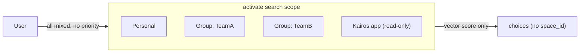

# Spaces Collaboration Readiness — Immediate Improvements

_Source: copied from Cursor plan `spaces_collaboration_improvements_d6adab87`. On this branch, P2 widget work was **not** applied (`spaces-widget-html` does not exist on `origin/main`)._

## Current State Summary

The spaces system is **identity-derived** (Keycloak auth produces personal + group spaces). Spaces are not CRUD objects — they exist because a user or group exists. The `spaces` tool is read-only inventory. Protocols live in exactly one space. There is no move, copy, fork, or override mechanism.

## Issues Found (Priority Order)

### P0 — Blocks collaboration

**1. `activate` output hides which space a protocol lives in**

- [activate_schema.ts](src/tools/activate_schema.ts) `activateOutputSchema.choices` has no `space_id` or `space_name` field.
- [search.ts](src/tools/search.ts) `addCandidate` deduplicates by adapter ID but does not propagate `space_id` from the Qdrant payload to the output.
- **Impact:** Agents and users cannot tell whether a matched protocol is personal, group, or app-level. Makes collaboration confusing — "whose protocol am I running?"

**2. No personal-over-group priority in `activate` ranking**

- Slug-based resolution in [memory-retrieval.ts](src/services/qdrant/memory-retrieval.ts) `findFirstStepMemoryUuidBySlug` prefers `defaultWriteSpaceId` (personal), but **errors** on ambiguity rather than shadowing.
- Vector `activate` in [store-methods.ts](src/services/memory/store-methods.ts) ranks purely by score — no space-based boost.
- **Impact:** A user who forks a group protocol into personal space has no guarantee their version will be preferred. Two identical-scoring protocols from different spaces result in unpredictable choice order.

**3. `activate`/search `space` parameter is broken for display names**

- [train.ts](src/tools/train.ts) resolves `"personal"`, `"Group: X"`, and group names to space IDs.
- [tenant-context.ts](src/utils/tenant-context.ts) `runWithOptionalSpaceAsync` used by `activate` checks `allowedSpaceIds.includes(spaceParam)` — which are raw IDs like `user:realm:sub`, `group:realm:ref`. Display names like `"Personal"` or `"Group: TeamA"` will **always fail**.
- The doc in [activate.md](src/embed-docs/tools/activate.md) says "space name" but the code requires the raw ID.
- **Impact:** Agents following the documented contract get `SPACE_NOT_FOUND` when trying to scope activation.

### P1 — Needed for collaboration workflows

**4. `tune` cannot change a protocol's space (no move/promote)**

- [tune.md](src/embed-docs/tools/tune.md) and [tune_schema.ts](src/tools/tune_schema.ts) have no `space` parameter.
- [memory-updates.ts](src/services/qdrant/memory-updates.ts) preserves existing `space_id` on update (`existingPayload.space_id`).
- **Impact:** Cannot promote a personal protocol to a group space or demote a group protocol to personal for editing. The only path is `export` + `delete` + `train` — destructive, loses execution history and adapter UUID continuity.

**5. No cross-space copy/fork mechanism**

- No `copy`, `clone`, `fork` tool exists in [src/tools/](src/tools/).
- **Impact:** A user cannot "fork group protocol X into my personal space, customize it, and have my version take priority." This is the core collaboration pattern the user described.

**6. `spaces` tool does not return space type**

- [spaces.ts](src/tools/spaces.ts) `buildSpaceInfo` returns `name` and `adapter_count` (optionally `adapters`), but not `type` (personal/group/app) or `space_id`.
- **Impact:** Agents cannot programmatically distinguish personal vs group. Display names like `"Group: TeamA"` require string parsing.

### P2 — UX polish for collaboration

**7. Spaces UI widget is minimal**

- [spaces-widget-html.ts](src/mcp-apps/spaces-widget-html.ts) `renderSpacesTable` shows only **Space | Adapters** (count). Does not show:
  - Individual adapter names per space (data is available when `include_adapter_titles` is true but widget ignores it).
  - Space type badge (personal/group/app).
  - Any management actions (move, copy, delete).
- **Impact:** Users must use the text-based `spaces` tool with `include_adapter_titles: true` to see what's where. No visual way to manage protocol placement.

**8. `spaces` doc doesn't explain collaboration patterns**

- [spaces.md](src/embed-docs/tools/spaces.md) is 12 lines. No guidance on:
  - Priority/precedence across spaces.
  - How to scope `activate` to a specific space.
  - How to move/copy protocols between spaces.

---

## Proposed Changes

### Phase 1: Make spaces visible and correct (P0)

**1a. Add `space_name` to `activate` / search output choices**

- In [activate_schema.ts](src/tools/activate_schema.ts): add `space_name: z.string().nullable()` to the choice object.
- In [search.ts](src/tools/search.ts): propagate `space_id` from Qdrant payload through `addCandidate`, then map to display name via `spaceIdToDisplayName` in the output mapping.
- In [activate.ts](src/tools/activate.ts): ensure `mapSearchToActivate` carries the new field.
- Update [activate.md](src/embed-docs/tools/activate.md) output description.

**1b. Add personal-space boost to activate ranking**

- In [store-methods.ts](src/services/memory/store-methods.ts) or [search.ts](src/tools/search.ts): when deduplicating candidates with near-equal scores, prefer the candidate from `defaultWriteSpaceId` (personal space). A small additive boost (e.g. +0.01 for personal space match) or tie-breaking logic.
- Slug resolution in [memory-retrieval.ts](src/services/qdrant/memory-retrieval.ts): change ambiguity from error to personal-preferred selection with a warning.

**1c. Unify space name resolution for `activate`**

- Extract `train.ts` space-name resolution logic into a shared utility in [tenant-context.ts](src/utils/tenant-context.ts) or a new `src/utils/resolve-space-param.ts`.
- Use that resolver in `runWithOptionalSpaceAsync` so `activate` accepts `"personal"`, `"Group: X"`, and group names — same contract as `train`.
- Update [activate.md](src/embed-docs/tools/activate.md) to document accepted formats.

### Phase 2: Enable cross-space operations (P1)

**2a. Add `space` parameter to `tune`**

- In [tune_schema.ts](src/tools/tune_schema.ts): add optional `space` field (same union as train).
- In [tune.ts](src/tools/tune.ts) or [memory-updates.ts](src/services/qdrant/memory-updates.ts): when `space` is provided and differs from the current `space_id`, update the Qdrant payload's `space_id` to the resolved target. This is effectively a "move."
- Validate: user must have write access to both source and target space.
- Update [tune.md](src/embed-docs/tools/tune.md).

**2b. Add `copy` action or a `fork` tool**

Two options (need decision):

- **Option A: `train` with `source_uri` parameter** — Add optional `source_uri` to `train` schema. When provided, `train` exports the source adapter's markdown and mints it into the target `space`. Preserves simplicity (no new tool).
- **Option B: Dedicated `fork` tool** — New tool that takes `uri` + `space`, copies the adapter to the target space, returns new URIs. More explicit, better discoverability.

Either way: the copy must create a new adapter UUID (not a reference). The original stays untouched.

**2c. Add `type` and `space_id` to `spaces` output**

- In [spaces.ts](src/tools/spaces.ts): add `type: 'personal' | 'group' | 'app'` and `space_id` to each space entry.
- Update schema and [spaces.md](src/embed-docs/tools/spaces.md).

### Phase 3: UI and documentation (P2)

**3a. Enhance spaces widget**

- Show adapter titles when available (the data is already in the tool response).
- Add space type badge/icon.
- Expandable rows per space showing adapter list.

**3b. Update embedded docs**

- [spaces.md](src/embed-docs/tools/spaces.md): document collaboration patterns (personal override, fork workflow, priority).
- [activate.md](src/embed-docs/tools/activate.md): document `space_name` in output, space scoping.
- [train.md](src/embed-docs/tools/train.md): document fork-from-group workflow.
- [tune.md](src/embed-docs/tools/tune.md): document move-between-spaces.

---

## Key Decision Needed

For **2b (cross-space copy)**: extend `train` with `source_uri` (Option A) or create a new `fork` tool (Option B)?

- **Option A** keeps the tool count low but overloads `train` semantics.
- **Option B** is cleaner but adds another tool to the MCP surface.

## Files Changed (Estimated)

| Phase | Files                                                                            | Type                  |
| ----- | -------------------------------------------------------------------------------- | --------------------- |
| 1a    | `activate_schema.ts`, `search.ts`, `activate.ts`, `activate.md`                  | Modify                |
| 1b    | `store-methods.ts` or `search.ts`, `memory-retrieval.ts`                         | Modify                |
| 1c    | `tenant-context.ts` (or new `resolve-space-param.ts`), `train.ts`, `activate.ts` | Modify + possible new |
| 2a    | `tune_schema.ts`, `tune.ts`, `memory-updates.ts`, `tune.md`                      | Modify                |
| 2b    | `train.ts` + `train_schema.ts` (A) or new `fork.ts` (B)                          | Modify or new         |
| 2c    | `spaces.ts`, `spaces_schema.ts`, `spaces.md`                                     | Modify                |
| 3a    | `spaces-widget-html.ts`                                                          | Modify                |
| 3b    | `activate.md`, `spaces.md`, `train.md`, `tune.md`                                | Modify                |
| Tests | `tests/unit/`, `tests/integration/`                                              | Modify + new          |

