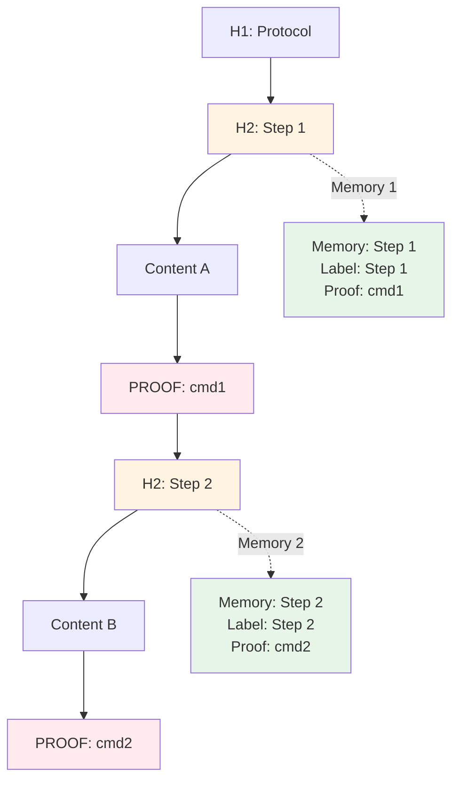
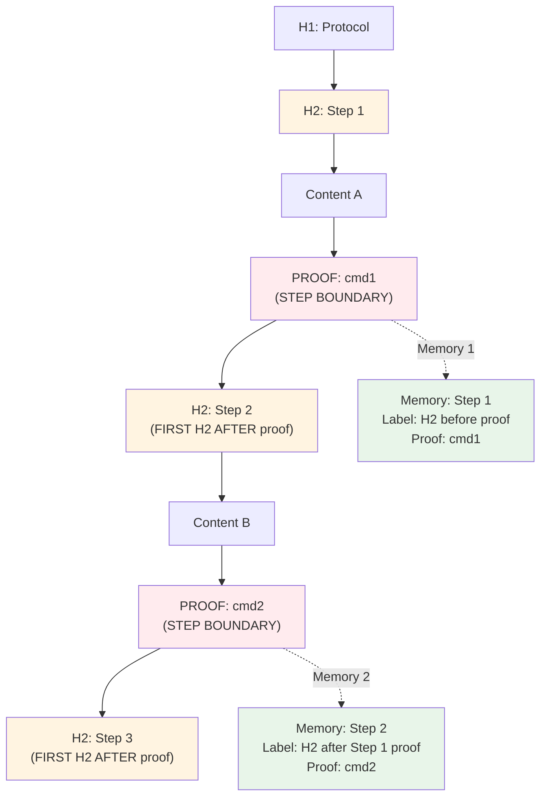
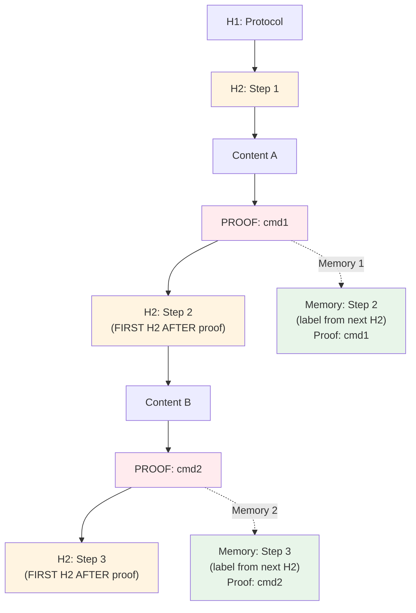

# Option 2: Slice by Proof-of-Work Lines (Modified)

**Scope**: This option simplifies the mode distinction - we don't need `proofMode=true` vs `proofMode=false`.

**Key Insight**: 
- No proof marker → full doc processed as single memory
- Proof marker at end (last H2 or after) → full doc processed as single memory (no split)
- Proof marker before end → slice by proof markers

**Result**: Both "no proof" and "proof at end" result in single memory. Only proofs before the end create splits. This eliminates the need for `proofMode` distinction.

**Important**: Each H1 starts a full workflow again as a new doc/chain. H1 sections are processed as separate chains.

## Summary

**Change**: Instead of slicing by H2 headers, slice by **proof-of-work lines**. Each proof-of-work line marks the end of a step boundary.

## Current Behavior (H2-based slicing)



**Problem**: H2 headers define step boundaries, but proof-of-work can be anywhere within a section. This creates a mismatch.

## Proposed Behavior (Proof-of-Work-based slicing)

**Variation**: Split on **first H2 AFTER proof-of-work marker**



**Solution**: 
- Proof-of-work lines define step boundaries
- Content from previous proof (or start) up to current proof becomes a step
- Step labels are built from H2 headers that appear in the step's content section
- H2s that appear AFTER a proof are the beginning of the NEXT step's label (collected when we move to that step)
- Each step naturally has its proof-of-work at the end

**Key Benefits**:
1. ✅ **Additional text after marker stays in step**: Any content after proof (but before next H2) is included in the current step - no weird splits
2. ✅ **Marker at end doesn't cause split**: If proof is at the end with no H2 after it, it's just part of the last step - no orphaned split

## Implementation Approach

### Step Detection Logic

**Single-pass parsing algorithm** (parse data only once):

```pseudocode
full_markdown = {}
doc = 1
step = 1

foreach line:
  if line matches H1 (x):
    full_markdown[doc][step].chain_label = x  
    doc += 1  // New H1 = new doc/chain
    step = 1  // Reset step for new doc
    continue

  if extractProofOfWork(line) returns (z):
    full_markdown[doc][step].proof_of_work = z
    full_markdown[doc][step].markdown_doc += line  // Include proof line in content
    continue

  if line matches H2 (y):
    // If current step has proof, this H2 is for the NEXT step
    if full_markdown[doc][step].proof_of_work is defined:
      step += 1  // Move to next step
    // Append H2 to current step's label (with separator if label exists)
    if full_markdown[doc][step].step_label exists:
      full_markdown[doc][step].step_label += " / " + y
    else:
      full_markdown[doc][step].step_label = y
    continue

  // Regular content line
  full_markdown[doc][step].markdown_doc += line

// After parsing:
// - If step == 1 at end: single memory (no proof or proof at end)
// - If step > 1: multiple steps created by proofs
// - If no H2 found, step_label is empty/undefined → use chain_label (H1) as fallback
```

**Algorithm is correct**: H2 AFTER proof is the BEGINNING of the NEXT step's label.

**How it works**:
- **Content collection**: All lines accumulate in `full_markdown[doc][step].markdown_doc` (including proof lines)
- **Proof detection**: Uses `extractProofOfWork()` function to detect and extract proof commands
- **H2 label building**: H2s accumulate in `full_markdown[doc][step].step_label` for the CURRENT step
- **Step increment on H2**: When we see an H2 AND current step has proof, we increment step (H2 after proof = next step)
- **Label fallback**: If no H2 found, `step_label` is empty → use `chain_label` (H1) as fallback
- **Multiple docs**: Each H1 creates a new doc/chain, resets step to 1

**Example**:
```markdown
## Step 1: Setup
Content
*   Proof of work: `test -f file`
## Step 2: Execute
```

**Algorithm execution**:
- H2 "Step 1" → `full_markdown[doc][1].step_label = "Step 1"` (Step 1's label from H2 before its proof)
- Proof → `step = 2` (move to next step)
- H2 "Step 2" → `full_markdown[doc][2].step_label = "Step 2"` ✅ This is Step 2's label (H2 after Step 1's proof)

**Result**:
- Step 1: Content + proof, label = "Step 1" (H2 before proof)
- Step 2: Content after proof, label = "Step 2" (H2 after Step 1's proof)

**Semantics**: 
- Each step's label is built from H2s that appear in its content section
- H2s BEFORE a proof become part of the current step's label
- H2s AFTER a proof become part of the NEXT step's label (collected when we increment step)
- The algorithm accumulates H2s into `full_markdown[doc][step].step_label` as it encounters them
- When a proof is seen, `step` increments, and subsequent H2s build the new step's label

**Complete example with algorithm trace**:
```markdown
# Protocol

## Step 1: Setup
Content A
*   Proof of work: `test -f file1`

## Step 2: Execute  
Content B
*   Proof of work: `test -f file2`
```

**Algorithm execution**:
1. H1 "Protocol" → `full_markdown[1][1].chain_label = "Protocol"`
2. H2 "Step 1" → `full_markdown[1][1].step_label = "Step 1"` (no proof yet, stays in step 1)
3. Content lines → `full_markdown[1][1].markdown_doc += line`
4. Proof line → `extractProofOfWork()` returns proof, `full_markdown[1][1].proof_of_work = proof`, `full_markdown[1][1].markdown_doc += line`
5. H2 "Step 2" → proof exists in step 1, so `step = 2`, then `full_markdown[1][2].step_label = "Step 2"` (H2 after proof = next step)
6. Content lines → `full_markdown[1][2].markdown_doc += line`
7. Proof line → `full_markdown[1][2].proof_of_work = proof`, `full_markdown[1][2].markdown_doc += line`

**Result**:
- Step 1: Content A + proof1, label = "Step 1" (H2 before proof)
- Step 2: Content B + proof2, label = "Step 2" (H2 after Step 1's proof, collected when step=2)

**Separator choice**: Use ` / ` (space-slash-space) for joining H2 headers. This is optimal for AI models:
- Token efficient (single-line labels)
- Clear semantic meaning (models understand `/` as separator)
- Better for structured data and tool responses
- Easier to parse programmatically

**Example**: If content between proofs has `## Step 2: Configure` and `## Step 3: Execute`, the label becomes `Step 2: Configure / Step 3: Execute`

### Edge Cases

**Case 1: Additional text after proof (before next H2)**
```markdown
# Protocol

## Step 1: Setup
Content A
*   Proof of work: `test -f config.env`

Additional notes and context here.
More explanation.

## Step 2: Execute
Content B
```
**Result**: 
- Step 1 includes: "Content A", proof, AND "Additional notes and context here. More explanation."
- Step 1 labeled: "Step 1: Setup" (H2 before proof, from algorithm)
- Step 2 labeled: "Step 2: Execute" (H2 after Step 1's proof, from algorithm)
- ✅ No weird split - all content after proof stays in Step 1 until next proof

**Case 2: Proof at end (no H2 after)**
```markdown
# Protocol

## Step 1: Setup
Content A
*   Proof of work: `test -f config.env`
```
**Result**: 
- **Single memory** with all content (same as "no proof" case)
- ✅ No split - proof at end means full document is one step
- This eliminates the need for `proofMode` distinction - both "no proof" and "proof at end" = single memory

**Case 3: Multiple proofs in one H2 section**
```markdown
# Protocol

## Step 1: Setup
Content A
*   Proof of work: `test -f file1`

More content
*   Proof of work: `test -f file2`

## Step 2: Execute
Content B
```
**Result**: 
- Step 1: Content A + proof1, labeled `Step 1: Setup` (H2 before proof1, from algorithm)
- Step 2: "More content" + proof2, labeled `Step 2: Execute` (H2 after proof1, from algorithm)
- Step 3: Content B, labeled from H2s after proof2 (if any)

## Pros

✅ **Natural alignment**: Proof-of-work defines what needs verification, so it should define step boundaries  
✅ **Flexible**: Proof can be anywhere in content, not tied to H2 structure  
✅ **Guaranteed proof**: Every step has proof-of-work by definition  
✅ **Clear semantics**: Step = "do this work, then prove it"  
✅ **Handles complex cases**: Multiple proofs per H2, proofs without H2, etc.  
✅ **Incremental development**: Add proof-of-work commands over time as workflows mature, instead of forcing fake/placeholder checks for every H2 upfront  
✅ **Fewer steps = less ping-pong**: Multiple H2s per proof means fewer steps, reducing unnecessary back-and-forth between AI and system  
✅ **Simpler mode logic**: No `proofMode` distinction needed - both "no proof" and "proof at end" result in single memory. Only proofs before the end create splits.  

## Resolved

✅ **Label ambiguity**: Multiple H2s after one proof - resolved by joining all H2 headers with ` / ` separator. This creates complete, unambiguous labels like `Step 2: Configure / Step 3: Execute`.

## Trade-offs / Characteristics

**Proof-of-work controls context size, not H2**: The original reason for H2 splitting was to keep AI context smaller. However, we learned that **without proof-of-work, AI would read all steps together anyway** (which is why Mode 1 stores as a single memory). 

**Proof-of-work is what actually controls step boundaries and context size** - each proof creates a verification checkpoint that requires completion before moving to the next step. H2 headers were just a convenient organizational tool, but they don't actually control context boundaries.

**H2 headers are labels, not structure**: In this approach, H2 headers serve as labels for steps (found after proof markers), but they don't define step boundaries. Proof-of-work lines define boundaries. This means:
- ✅ More flexible: You can place proofs anywhere, not tied to H2 structure
- ✅ Documents without H2 headers still work (use H1 as label)
- ✅ Aligns with reality: Proof-of-work is what actually controls context size, so it should define boundaries

**Steps may not align with visual H2 structure**: Since step boundaries are defined by proofs (not H2s), the visual markdown structure might not match the actual step boundaries. For example, one H2 section could contain multiple proofs (creating multiple steps), or a proof could span across H2 boundaries. This is intentional - proof-of-work is the source of truth for step boundaries and context control.

**Note**: Parsing is single-pass - we accumulate H2s into the current step's label as we encounter them. When we see a proof, we move to the next step, and subsequent H2s build that step's label.  

## Example Documents

### Example 1: Standard (one proof per H2)
```markdown
# Protocol

## Step 1: Setup
*   Configure environment
*   Proof of work: `test -f config.env`

## Step 2: Execute
*   Run process
*   Proof of work: `test -f output.log`
```

**Result**: 2 steps
- Step 1: Label `Step 2: Execute` (H2s after proof1, joined) with proof `test -f config.env`
- Step 2: Label from H2s after proof2 (or H1 if none) with proof `test -f output.log`

### Example 2: Multiple proofs per H2
```markdown
# Protocol

## Step 1: Setup
*   Configure environment
*   Proof of work: `test -f config.env`

*   Install dependencies
*   Proof of work: `test -f deps.lock`
```

**Result**: 2 steps
- Step 1: Label from H2s after proof1 (or H1 if none) with proof `test -f config.env`
- Step 2: Label from H2s after proof2 (or H1 if none) with proof `test -f deps.lock`
- If no H2s after proofs, both use H1 title "Protocol"

### Example 3: Proof before H2
```markdown
# Protocol

Introduction and setup instructions.

*   Proof of work: `test -f init.log`

## Step 1: Execute
*   Run process
*   Proof of work: `test -f output.log`
```

**Result**: 2 steps
- Step 1: Label `Step 1: Execute` (H2s after proof, joined) with proof `test -f init.log`
- Step 2: Label from H2s after proof2 (or H1 if none) with proof `test -f output.log`

## Critical Analysis (Ruthless Critique)

**The Hard Truth**: Option 2 adds significant complexity for questionable benefit.

### Complexity Explosion

**Option 1**: 
- H2 = step boundary (clear, predictable)
- Proof required in each H2 (simple validation)
- Label = H2 title (obvious, no ambiguity)
- **Parsing**: Split by H2, check for proof, done.

**Option 2**:
- Proof = step boundary (must scan document)
- Find all H2s after proof (forward scanning)
- Join H2s with ` / ` (string manipulation)
- Handle edge cases: no H2 after proof, multiple H2s, proof at end
- **Parsing**: Find proofs, scan forward for H2s, join, handle edge cases.

**Verdict**: Option 2 is 3-4x more complex in parsing logic.

### What Problem Does It Actually Solve?

**The Real Use Case**: **We DON'T need proof-of-work for each H2**. The case is REVERSED - we need **multiple H2s per proof**.

**Example**:
```markdown
# Protocol

## Step 1: Setup Environment
*   Configure variables

## Step 2: Install Dependencies
*   Run npm install

## Step 3: Build Project
*   Run build script

*   Proof of work: `test -f dist/bundle.js`
```

**Option 1** (proof per H2): Would require 3 proofs, one for each H2. **Overkill** - we only need to verify the final result.

**Option 2** (proof defines boundary): Creates ONE step with all 3 H2 sections, verified by one proof. **Correct** - matches the actual verification need.

**Reality Check**: 
- Option 1 forces proof for every H2, even when verification is only needed at the end
- Option 2 allows grouping related H2s under one proof, matching actual verification needs
- **Option 2 solves a real problem: avoiding unnecessary proof requirements**

### Reliability Issues

**Edge Cases in Option 2**:
1. Proof before any H2 → use H1 (inconsistent labeling)
2. Multiple H2s after proof → join with ` / ` (label becomes long, harder to match)
3. Proof at end → no H2 after (special case handling)
4. Multiple proofs in one H2 → creates multiple steps with same label prefix

**Option 1**: One H2 = one step = one proof. **Zero ambiguity.**

### AI Interaction Impact

**Label Matching**: 
- Option 1: `Step 1: Setup` → easy to match, clear semantics
- Option 2: `Step 2: Configure / Step 3: Execute` → harder to match, ambiguous what the step actually is

**Context Clarity**:
- Option 1: Step content = H2 section (clear boundaries)
- Option 2: Step content = everything between proofs (could span multiple H2s, unclear boundaries)

### The Brutal Truth

**Option 1 forces proof for every H2, even when you only need verification at the end of a multi-step process**. This creates two problems:

1. **Fake checks**: Forces authors to create placeholder/fake proof commands for H2s that don't need verification yet
2. **Ping-pong hell**: More steps = more `kairos_next` calls = more back-and-forth between AI and system

**Example**: Setup → Configure → Build → Verify (one proof). 
- Option 1: 4 steps, 4 proofs (3 fake), 4 `kairos_next` calls
- Option 2: 1 step, 1 proof, 1 `kairos_next` call

**Option 2 matches reality AND reduces AI interaction overhead.**

**Additional benefit**: Option 2 allows **incremental development** - start with H2 structure, add proofs as workflows mature. Option 1 forces you to create proofs upfront (even fake ones) or the document won't mint.

**Recommendation**: Choose Option 2 if you want realistic verification, incremental development, and fewer AI interactions. Choose Option 1 only if every H2 truly needs independent verification AND you're okay with forcing proofs upfront.

## Decision Criteria

Choose this option if:
- You have workflows where **multiple H2s share one proof** (common case)
- You want to avoid forcing proof for every H2 when verification is only needed at the end
- You need proof placement flexibility (proof can be anywhere, not tied to H2 structure)
- You're willing to accept increased parsing complexity for this flexibility

Choose Option 1 if:
- Every H2 truly needs independent verification
- You want simpler, more predictable parsing
- You're okay with requiring proof for every H2 section

## Modified Approach: Split on First H2 AFTER Proof

**Key variation**: Instead of using the last H2 before proof, use the **first H2 AFTER the proof** as the label for the NEXT step.

### Logic

1. **Find proof-of-work lines** in the document
2. **For each proof-of-work line**:
   - Collect content from previous proof (or start) up to and including the proof line
   - Look for the **first H2 header AFTER this proof line**
   - Use that H2 as the label for the **next step** (the step that will follow)
   - If no H2 found after proof, use H1 title or previous label

### Example

```markdown
# Protocol

## Step 1: Setup
*   Configure environment
*   Proof of work: `test -f config.env`

## Step 2: Execute
*   Run process
*   Proof of work: `test -f output.log`

## Step 3: Verify
*   Check results
```

**Processing**:
1. First proof found: `test -f config.env`
   - Content: "Step 1: Setup" section up to proof
   - First H2 after proof: "## Step 2: Execute"
   - **Step 1 label**: "Step 2: Execute" (the NEXT step)
   - **Step 1 proof**: `test -f config.env`

2. Second proof found: `test -f output.log`
   - Content: "Step 2: Execute" section up to proof
   - First H2 after proof: "## Step 3: Verify"
   - **Step 2 label**: "Step 3: Verify" (the NEXT step)
   - **Step 2 proof**: `test -f output.log`

3. Last section (no proof after it)
   - Content: "Step 3: Verify" section
   - No H2 after (end of document)
   - **Step 3 label**: "Step 3: Verify" (current H2)
   - **Step 3 proof**: None (or error if proof required)

### Visual Flow



### Semantics

**Rationale**: 
- Proof-of-work marks completion of work
- The H2 that follows defines what comes NEXT
- So the step label points to "what you're preparing for" rather than "what you just did"
- This creates a forward-looking chain: "Complete this work (proof), then move to next step (H2 after)"

### Edge Cases

**Case 1: Proof at end, no H2 after**
```markdown
# Protocol

## Step 1: Setup
*   Proof of work: `test -f config.env`
```
**Result**: Step labeled with current H2 ("Step 1: Setup") or H1 if no H2

**Case 2: Multiple H2s after proof (before next proof)**
```markdown
# Protocol

## Step 1: Setup
*   Proof of work: `test -f config.env`

## Step 2: Execute
Content for step 2

## Step 3: Verify
Content for step 3
*   Proof of work: `test -f output.log`
```
**Result**: 
- Step 1 label: `Step 2: Execute / Step 3: Verify` (all H2s between proof1 and proof2, joined with ` / `)
- Step 1 proof: `test -f config.env`

**Case 3: Proof before any H2**
```markdown
# Protocol

Introduction text.
*   Proof of work: `test -f init.log`

## Step 1: Execute
```
**Result**: Step labeled "Step 1: Execute" (first H2 after proof)

