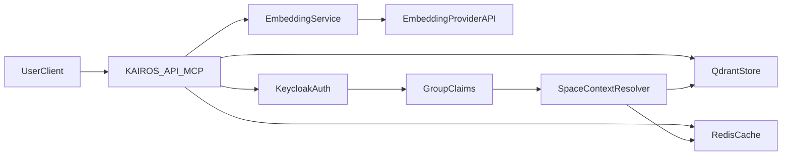

# Threat model

This document defines the KAIROS MCP threat model aligned to NIST SP 800-218A.
It captures system boundaries, protected assets, likely threat actors, and
current mitigations implemented in Phases 0 through 2.5.

## System boundary

The system boundary includes the API surface, identity layer, storage systems,
and external embedding providers. Traffic enters through HTTP or MCP and then
flows into embedding and storage paths.

## Asset inventory

You must protect the following assets because compromise directly affects
integrity, confidentiality, or availability.

- Protocol chains and memory content in Qdrant.
- Embedding vectors and relevance metadata.
- Tenant and space authorization context from Keycloak claims.
- Session data, cache entries, and request correlation data.
- Provider API credentials and release pipeline artifacts.

## Threat actors

Threat analysis assumes these actor classes are realistic in production.

- Malicious tenant attempting cross-tenant reads or writes.
- Insider with valid credentials abusing elevated actions.
- External attacker probing API and auth error paths.
- Compromised dependency or CI supply-chain component.
- Compromised embedding provider key or provider endpoint abuse.

## Threat scenarios and mitigations

This section maps key threats to controls already implemented in code and
pipeline configuration.

### Data poisoning via crafted content

Attackers can attempt to degrade retrieval quality by injecting low-quality or
malicious content.

- **Mitigations in place**
  - Input validation and schema enforcement on tool and HTTP entry points.
  - Audit logging for embedding requests with tenant and request correlation.
  - Anomaly logging for unusual vector norm, latency spikes, and low-score
    search behavior.
  - Memory metadata with `created_by` and `modified_by` for forensic tracing.

### Prompt injection through stored protocol steps

Stored protocol text can include manipulation attempts that influence agent
execution.

- **Mitigations in place**
  - Deterministic protocol execution flow (`search -> begin -> next -> attest`).
  - Structured protocol validation during train (store) operations.
  - Explicit `must_obey` and `next_action` semantics in protocol output.
  - Audit and incident runbook support for suspicious train and update events.

### Cross-tenant data leakage

Cross-tenant leakage risk exists in retrieval, cache scoping, and direct memory
operations.

- **Mitigations in place**
  - Space-scoped filtering and strict tenant-aware retrieval checks.
  - Group and user-derived space context from authenticated claims.
  - Forbidden access handling for out-of-scope memory IDs.
  - Request correlation for incident triage and tenant-scoped tracing.

### Embedding API abuse and cost amplification

Attackers can send costly input patterns or abuse compromised provider keys.

- **Mitigations in place**
  - Rate limiting on HTTP and MCP routes.
  - Structured embedding audit records with request metrics.
  - Security-focused Renovate and release pipeline controls.
  - Incident playbooks for key rotation and traffic anomaly containment.

### Supply-chain and release compromise

Compromise of dependencies or release artifacts can introduce backdoors.

- **Mitigations in place**
  - CI scanning for vulnerabilities and static analysis.
  - CycloneDX SBOM generation in release workflow.
  - Cosign image signing in release workflow.
  - Security update prioritization in Renovate configuration.

## Residual risks

Residual risk remains and must be managed continuously.

- Heuristic anomaly detection can miss novel attack patterns.
- External embedding providers remain a third-party trust dependency.
- Identity misconfiguration can weaken group-to-space controls.
- Operational delays in key rotation can increase blast radius.

## Assumptions

This threat model relies on these assumptions.

- Keycloak remains the source of truth for group claims.
- Sensitive secrets stay outside source control and are rotated regularly.
- Production logging keeps retention and access controls enforced.
- Incident response staffing and escalation coverage are active.

## Next steps

You should review this document after every major auth, storage, or release
pipeline change. Add new threat scenarios when a new external dependency or
privileged operation is introduced.

