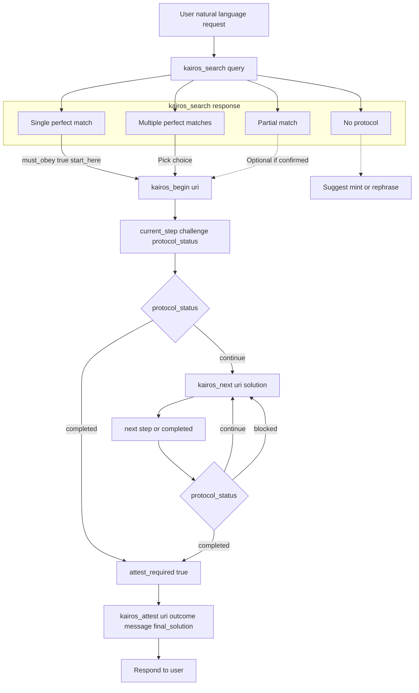

# KAIROS Workflow (Original)

This document describes the workflow **as it was** before the Simplify KAIROS Teaching Stack plan (Phase 1 and Phase 2). Copied and adapted from the plan for reference.

---

## Current workflow (starting with kairos_search)

**Entry point:** User natural language request → AI calls `kairos_search(query)` with a search term derived from intent.

**kairos_search response branches:**

| Scenario                 | Response                                         | Next action                               |
| ------------------------ | ------------------------------------------------ | ----------------------------------------- |
| Single perfect match     | `must_obey: true`, `start_here: uri`             | Call `kairos_begin(uri)`                  |
| Multiple perfect matches | `must_obey: false`, `choices: [{uri, label}...]` | Pick one, call `kairos_begin(choice.uri)` |
| Partial match            | `must_obey: false`, `best_match: {uri, score}`   | Optional: `kairos_begin` if confirmed     |
| No results               | `protocol_status: 'no_protocol'`                 | Suggest minting or rephrasing             |

**must_obey semantics:** For multiple or partial matches, `must_obey: false` lets the AI choose which protocol to follow. Once a choice is made via `kairos_begin`, the response has `must_obey: true` and execution becomes mandatory.

- **kairos_begin** (step 1 only): Returns `current_step`, `challenge`, `protocol_status` (`continue` or `completed`). If `continue` → `next_action: "call kairos_next"`. If `completed` → `attest_required: true`.
- **kairos_next** (steps 2+): Requires `uri` + `solution` matching `challenge.type`. Returns next step or `protocol_status: 'completed'` with `attest_required: true`. Invalid solution → `protocol_status: 'blocked'`. Loop until completed.
- **kairos_attest**: Called when `attest_required: true`. Updates quality metrics in Qdrant. After attest → protocol done; AI may respond to user.



---

## Proof of work (challenge/solution)

Each protocol step can define a **challenge** (via `PROOF OF WORK:` in markdown → `proof_of_work` metadata). The AI must submit a matching **solution** via `kairos_next` to advance.

- **Minting:** `kairos_mint` parses `PROOF OF WORK:` lines into `proof_of_work` on each memory step.
- **Runtime:** `kairos_begin` / `kairos_next` use `buildChallenge()` to turn `proof_of_work` into a `challenge` object returned to the AI.
- **Ordering:** Backend blocks progress until the **previous** step's proof is stored and successful.

### Challenge types (original)

| Type       | Example                         | Definition                                        |
| ---------- | ------------------------------- | ------------------------------------------------- |
| shell      | Run `mkdir -p src`              | Command + timeout; must complete with exit code   |
| mcp        | Call MCP tool X                 | Tool name + optional expected result              |
| user_input | Confirm with user               | Prompt for human confirmation                     |
| comment    | Min-length verification comment | Minimum character length for verification comment |

Shell and mcp can fail (non-zero exit / `success: false`). Comment/user_input are structurally validated only (no nonce, no previousProofHash, no semantic check on comment).

---

## Challenge / solution examples (all supported types)

In the **original** workflow, challenges do **not** include `nonce` or `genesis_hash`; solutions do **not** include `nonce` or `previousProofHash`.

### 1. Shell

**Step definition (markdown):**

```markdown
## Step 1: Setup

Create the project directory.

PROOF OF WORK: timeout 30s mkdir -p src
```

**Challenge returned to AI (example):**

```json
{
  "type": "shell",
  "description": "Execute shell command: mkdir -p src",
  "shell": {
    "cmd": "mkdir -p src",
    "timeout_seconds": 30
  }
}
```

**Solution (success):**

```json
{
  "type": "shell",
  "shell": {
    "exit_code": 0,
    "stdout": "",
    "stderr": "",
    "duration_seconds": 0.1
  }
}
```

**Solution (failure):**

```json
{
  "type": "shell",
  "shell": {
    "exit_code": 1,
    "stdout": "",
    "stderr": "mkdir: permission denied",
    "duration_seconds": 0.05
  }
}
```

---

### 2. MCP

**Step definition (markdown):**

```markdown
## Step 2: Call API

Invoke the external MCP tool.

PROOF OF WORK: mcp my_tool_name
```

**Challenge returned to AI (example):**

```json
{
  "type": "mcp",
  "description": "Call MCP tool: my_tool_name",
  "mcp": {
    "tool_name": "my_tool_name",
    "expected_result": null
  }
}
```

**Solution (success):**

```json
{
  "type": "mcp",
  "mcp": {
    "tool_name": "my_tool_name",
    "arguments": { "param": "value" },
    "result": { "ok": true },
    "success": true
  }
}
```

**Solution (failure):**

```json
{
  "type": "mcp",
  "mcp": {
    "tool_name": "my_tool_name",
    "arguments": {},
    "result": { "error": "timeout" },
    "success": false
  }
}
```

---

### 3. User input

**Step definition (markdown):**

```markdown
## Step 3: Confirm

Get user approval before proceeding.

PROOF OF WORK: user_input "Approve deployment?"
```

**Challenge returned to AI (example):**

```json
{
  "type": "user_input",
  "description": "User confirmation: Approve deployment?",
  "user_input": {
    "prompt": "Approve deployment?"
  }
}
```

**Solution:**

```json
{
  "type": "user_input",
  "user_input": {
    "confirmation": "yes",
    "timestamp": "2025-02-13T12:00:00.000Z"
  }
}
```

_(Original: AI relays confirmation; no MCP Elicitation.)_

---

### 4. Comment

**Step definition (markdown):**

```markdown
## Step 4: Review

Summarize what you learned from this step.

PROOF OF WORK: comment min_length=20
```

**Challenge returned to AI (example):**

```json
{
  "type": "comment",
  "description": "Provide a verification comment (minimum 20 characters)",
  "comment": {
    "min_length": 20
  }
}
```

**Solution:**

```json
{
  "type": "comment",
  "comment": {
    "text": "I reviewed the security checklist and verified all three items."
  }
}
```

_(Original: only length is validated; any text ≥ min_length passes.)_

---

## Summary

| Type       | Challenge fields (original)   | Solution fields (original)                        |
| ---------- | ----------------------------- | ------------------------------------------------- |
| shell      | type, description, shell      | type, shell (exit_code, stdout, stderr, duration) |
| mcp        | type, description, mcp        | type, mcp (tool_name, arguments, result, success) |
| user_input | type, description, user_input | type, user_input (confirmation, timestamp)        |
| comment    | type, description, comment    | type, comment (text)                              |

No `nonce`, `genesis_hash`, or `previousProofHash` in the original workflow.
