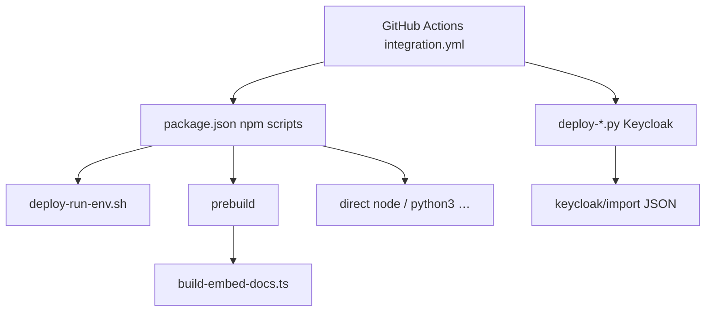

# Scripts

This directory holds maintainer and automation helpers. Prefer **`npm run …`** from the repo root `package.json` instead of invoking shell entrypoints directly unless you know you need to.

## Naming (CI-style stages)

File names use a **prefix** so you can see which pipeline stage they belong to:

| Prefix | Meaning |
|--------|---------|
| **`lint-`** | Static checks and policy gates (skills layout, forbidden patterns in `src/`) |
| **`build-`** | Codegen, packaging, and build-time config consumed by Vite/tsc (`prebuild`, `.tgz`) |
| **`test-`** | Test drivers, fixtures, and integration helpers (including Playwright captures) |
| **`ci-`** | **GitHub Actions workflow glue** — step wrappers, `$GITHUB_STEP_SUMMARY`, infra polling, etc. |
| **`ci-test-`** | CI-oriented **test verification** (e.g. install smoke checks for release tarballs); still run locally via `npm run` when needed |
| **`deploy-`** | Local/prod **environment** lifecycle: `.env`, Compose/Keycloak, run server/tests via one script, raw Qdrant probes |

**Rule:** Workflow orchestration in `scripts/` **must** start with **`ci-`** (e.g. `ci-github-step-summary.mjs`, `ci-parallel-checks.mjs`, `ci-wait-for-infra.sh`). Scripts whose main job is **test-style checks for CI / release** may use **`ci-test-`** (e.g. `ci-test-tgz-install.mjs`) instead of plain `test-`. (Jest’s job-summary reporter stays under `tests/reporters/` because Jest loads it by path.)

`src/embed-docs/` is **not** under `scripts/`; it is the source tree the **`build-embed-docs`** step reads.

## Overview

Most work flows through **npm scripts**, which call **`deploy-run-env.sh`** for dev/prod actions or **Node/Python** utilities for lint/build/test. **CI** uses **`ci-*`** helpers for `$GITHUB_STEP_SUMMARY`. Keycloak JSON under `keycloak/import/` is applied by **`deploy-configure-keycloak-realms.py`**.

## Script index

Paths are relative to the repo root (`scripts/…`). **Used from** lists primary call sites; *manual* means there is no `npm` script.

| Script | What it does | Used from |
|--------|----------------|-----------|
| `scripts/deploy-run-env.sh` | Dev/prod helper: start/stop app, tests, logs, health, Redis/Qdrant shells, coding-rules check; loads `.env`, optional Keycloak realm sync | `npm run dev:*`, `npm run prod:*`, `npm run ensure-coding-rules`, `npm run test:load`; invokes `deploy-copy-env-from-main.sh`, `deploy-configure-keycloak-realms.py` where applicable |
| `scripts/deploy-dev-cli-ready.sh` | Waits for local MCP readiness; may run Keycloak realm configure when admin password is set | `npm run dev:cli-ready` |
| `scripts/deploy-copy-env-from-main.sh` | In a git worktree, copies `.env` from the main worktree when missing | `deploy-run-env.sh` |
| `scripts/env/create-env.sh` | Thin wrapper: creates `.env` via secrets generator when you use this entrypoint | Invokes `deploy-generate-dev-secrets.py` |
| `scripts/ci-wait-for-infra.sh` | Polls Redis, Qdrant, Postgres, and Keycloak in Docker Compose (CI) | `.github/workflows/integration.yml` |
| `scripts/deploy-add-keycloak-demo-user.sh` | Adds `demo` user to `kairos-dev` via `kcadm` inside the Keycloak container | Documented in `scripts/keycloak/import/README.md` |
| `scripts/deploy-generate-dev-secrets.py` | Fills repo-root `.env` from `scripts/env/.env.template` (secrets from env or generated) | `.github/workflows/integration.yml`, `scripts/env/create-env.sh`; see `docs/install/README.md` and `compose.yaml` comments |
| `scripts/deploy-configure-keycloak-realms.py` | Idempotent realm admin: merges `scripts/keycloak/import/*.json`, clients, groups, test users | `npm run infra:up`, `deploy-run-env.sh`, `deploy-dev-cli-ready.sh`, `.github/workflows/integration.yml`, `tests/global-setup-auth.ts` |
| `scripts/deploy-configure-keycloak-google-idp.py` | Creates or updates Google IdP on a Keycloak realm | `npm run dev:google-idp`; see `docs/install/google-auth-dev.md` |
| `scripts/deploy-add-keycloak-user` | Adds a realm user with auto-generated password via Admin REST API | `scripts/keycloak/import/README.md` (examples) |
| `scripts/lint-agent-skills.py` | Validates agent skills layout against repo rules | `npm run lint:skills` |
| `scripts/sync-kairos-install-references.py` | Copies `docs/install/{docker-compose-*,cursor-mcp,env-and-secrets}.md`, `docs/install/google-auth-dev.md`, and `docs/CLI.md` into `skills/.system/kairos-install/references/` and patches outbound links for the bundled layout | `npm run skills:sync-install-refs`; see `skills/.system/kairos-install/references/README.md` |
| `scripts/lint-verify-clean-source.mjs` | Prebuild gate: forbids `console.*` and test mocks under `src/` (AST-based) | `npm run verify:clean` (`prebuild`) |
| `scripts/build-embed-docs.ts` | Bundles `src/embed-docs/**` into generated TS resources for the server | `npm run prebuild` (`npx ts-node scripts/build-embed-docs.ts`) |
| `scripts/build-embed-docs-slug-meta.ts` | Slug/frontmatter helpers for `build-embed-docs.ts` | Imported by `build-embed-docs.ts` only |
| `scripts/build-vite-ui-env-define.ts` | Exposes package version to Vite/Vitest via `import.meta.env` | `vite.config.ts`, `vitest.config.ts` |
| `scripts/build-sync-skill-versions.mjs` | Keeps skill metadata versions aligned with `package.json` | `npm run prebuild`, `npm run version:sync-skills`, `npm run version:check-skills`, release `npm version` scripts |
| `scripts/build-ensure-tgz.mjs` | Builds the publishable `.tgz` into `dist/` | `npm run build:tgz` |
| `scripts/ci-test-tgz-install.mjs` | Installs the built tarball into a temp dir to verify packaging | `npm run test:tgz` |
| `scripts/ci-github-step-summary.mjs` | Runs a subprocess and appends a Vitest-style block to `$GITHUB_STEP_SUMMARY` | `.github/workflows/integration.yml` (many steps) |
| `scripts/ci-parallel-checks.mjs` | Runs `tsc --noEmit`, `knip`, and `test:ui` in parallel; appends summaries | `.github/workflows/integration.yml` |
| `scripts/test-embedding-key.mjs` | Quick check that `OPENAI_API_KEY` can call the configured embedding model | `npm run dev:test-embedding-key` |
| `scripts/test-capture-viewports.mjs` | Playwright capture of UI viewports for design review | `npm run design:viewports` |
| `scripts/test-integration-app-base-url.mjs` | Resolves local KAIROS base URL from env (shared helper) | `test-ai-mcp-integration.mjs`, `test-capture-viewports.mjs` |
| `scripts/deploy-raw-qdrant-search.mjs` | Runs a raw scroll/search against Qdrant using env config | `npm run prod:raw-qdrant-search` |
| `scripts/test-ai-mcp-integration.mjs` | End-to-end AI MCP integration driver (reports, proof flow) | `npm run dev:ai-mcp-integration`; listed in `.github/codeql/codeql-config.yml` |
| `scripts/test-ai-mcp-integration-auth-utils.mjs` | Bearer/auth header helpers for integration scripts | `test-ai-mcp-integration.mjs` |
| `scripts/test-ai-mcp-integration-proof-utils.mjs` | Proof/challenge helpers for integration scripts | `test-ai-mcp-integration.mjs` |
| `scripts/test-ai-mcp-integration-report-utils.mjs` | Report formatting for integration output | `test-ai-mcp-integration.mjs`, `tests/unit/ai-mcp-integration-report-utils.test.ts` |

### Related files (not executable scripts)

| Path | Role |
|------|------|
| `scripts/env/.env.template` | Template consumed by `deploy-generate-dev-secrets.py` |
| `scripts/keycloak/import/*.json` | Realm JSON merged by `deploy-configure-keycloak-realms.py` (see `scripts/keycloak/import/README.md`) |
| `scripts/kairos-db-init/README.md` | Notes for DB init assets |

## Troubleshooting

1. **`deploy-run-env.sh` exits and tells you not to run it directly**  
   Export `ENV=dev` or `ENV=prod` is required for most subcommands. From the repo root, use `npm run dev:start`, `npm run dev:test`, etc., so `ENV` and `.env` loading stay consistent.

2. **Shell scripts fail with “Permission denied”**  
   Ensure execute bits are set (e.g. `chmod +x scripts/deploy-run-env.sh scripts/deploy-dev-cli-ready.sh`). Clone and umask differences sometimes drop `+x`.

3. **Python Keycloak scripts fail with 401 or connection errors**  
   Confirm Keycloak is up (`npm run infra:up` or your stack), `KEYCLOAK_URL` matches, and `KEYCLOAK_ADMIN_PASSWORD` is set in `.env`. For realm JSON changes, re-run `python3 scripts/deploy-configure-keycloak-realms.py`.

4. **Node reports wrong version or missing modules**  
   This repo expects **Node ≥ 25** (`package.json` `engines`). Run `npm ci` at the repo root after pulling; scripts assume dependencies are installed.

5. **CI-only helpers print nothing locally**  
   `ci-github-step-summary.mjs` only appends to `$GITHUB_STEP_SUMMARY` when that variable is set (GitHub Actions). Running it locally still runs the wrapped command; the summary file is simply absent.
