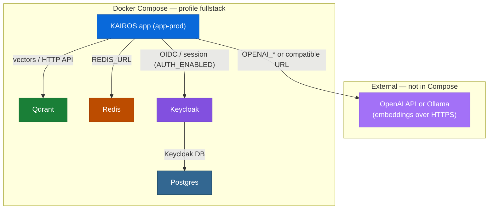

# Install KAIROS with Docker Compose (full stack)

This guide starts **Redis**, **Postgres**, **Keycloak**, and the **app** with
the **`fullstack`** Compose profile. Use this when you need local
auth-related features, Redis-backed behavior, and the Keycloak dev realm setup
documented in this repository.

Work through the sections **in order**. Do not run `docker compose … up` until
`.env` exists and required variables (including Redis and Keycloak secrets) are
set.

## Prerequisites

1. **Docker Engine** and **Docker Compose v2** installed and running.
2. **Clone** [kairos-mcp](https://github.com/debian777/kairos-mcp) (or an
   equivalent tree with `compose.yaml`, `docs/install/`, and
   `scripts/deploy-configure-keycloak-realms.py` if you use `npm run infra:up`).
3. **Python 3** on the host if you use `npm run infra:up` (realm configuration).
4. **Qdrant** — provided by Compose (same as the simple stack); ensure Qdrant
   ports are free unless overridden.
5. **Embeddings (OpenAI or Ollama)** — same requirement as the minimal stack;
   see [Environment variables and secrets — Embedding backends](env-and-secrets.md#embedding-backends).

## 1. MCP client configuration (`mcp.json`)

MCP uses the **KAIROS app** HTTP port (`PORT` in `.env`, default **3000**), not
Keycloak’s 8080. Use `http://localhost:<PORT>/mcp`.

Open **Settings → MCP → Edit config** in Cursor and add:

```json
{
  "mcpServers": {
    "KAIROS": {
      "type": "streamable-http",
      "url": "http://localhost:3000/mcp",
      "alwaysAllow": [
        "activate",
        "forward",
        "train",
        "reward",
        "tune",
        "delete",
        "export",
        "spaces"
      ]
    }
  }
}
```

When `AUTH_ENABLED=true`, Cursor may need OAuth via
`/.well-known/oauth-protected-resource` or CLI login first. See
[Install MCP in Cursor](cursor-mcp.md) and [CLI authentication](../CLI.md#authentication).

## 2. Installation

Use the **repository root** so paths to scripts and `docs/install/` match this
guide.

## 3. Environment file

Create **`.env`** at the repository root. Paste the block below, then set
secrets and embedding variables.

**Full stack** (Redis, Postgres, Keycloak, `AUTH_ENABLED=true`). For the app
**inside** Compose, set `REDIS_URL` to the **`redis`** hostname (see comment in
block).

```env
# ------------------------------------------------------------
# KAIROS MCP — Full stack (infra + app + auth)
# Repository root .env — set secrets before docker compose up.
# ------------------------------------------------------------

# --- Required: infra ---
QDRANT_URL=http://127.0.0.1:6333
QDRANT_API_KEY=change-me
REDIS_PASSWORD=change-me
# App container in Compose (use this line when app runs in Docker):
REDIS_URL=redis://:change-me@redis:6379
# Host-run app / tests against mapped Redis:
# REDIS_URL=redis://:change-me@127.0.0.1:6379

# --- Required: embeddings (set one path) ---
OPENAI_API_KEY=

# --- Optional: app ---
# PORT=3000
# METRICS_PORT=9090
# QDRANT_COLLECTION=kairos
# OPENAI_EMBEDDING_MODEL=text-embedding-3-small
# OPENAI_API_URL=https://api.openai.com
# QDRANT_SNAPSHOT_DIR= (omit → 503 on POST /api/snapshot)

# --- Required: auth ---
AUTH_ENABLED=true
SESSION_SECRET=
# Match the app port you expose (3000 for default Compose; use 3300 if you align with npm dev:deploy on host).
AUTH_CALLBACK_BASE_URL=http://localhost:3000
KEYCLOAK_URL=http://localhost:8080
KEYCLOAK_REALM=kairos-dev
KEYCLOAK_CLIENT_ID=kairos-mcp
KEYCLOAK_CLI_CLIENT_ID=kairos-cli
# KEYCLOAK_INTERNAL_URL=http://keycloak:8080
KEYCLOAK_ADMIN_USERNAME=admin
KEYCLOAK_ADMIN_PASSWORD=
KEYCLOAK_DB_PASSWORD=
AUTH_MODE=oidc_bearer
AUTH_TRUSTED_ISSUERS=http://localhost:8080/realms/kairos-dev
AUTH_ALLOWED_AUDIENCES=kairos-mcp,kairos-cli
```

Set at least:

- `QDRANT_API_KEY`, `REDIS_PASSWORD`, `SESSION_SECRET`, `KEYCLOAK_ADMIN_PASSWORD`,
  `KEYCLOAK_DB_PASSWORD`
- `REDIS_URL` with the **correct** host for where the app runs (`redis` vs
  `127.0.0.1` — see [Environment variables and secrets](env-and-secrets.md))
- One embedding backend

### Free the default ports

Check for conflicts on (at minimum) app `PORT` (default **3000**), **6333** /
**6344** (Qdrant), **6379** (Redis), **5432** (Postgres), **8080** / **9000**
(Keycloak), and **9090** (metrics) unless you change them in `.env` or Compose.

## 4. Start the stack and use MCP

Only after `.env` is complete:

```bash
docker compose -p kairos-mcp --profile fullstack up -d
```

### Optional: realm and client setup via npm

From a Node dev checkout at the repo root (uses the same `.env`):

```bash
npm run infra:up
```

That runs Compose with `--profile fullstack` and executes
`scripts/deploy-configure-keycloak-realms.py`.

### Optional Redis Insight UI

```bash
docker compose -p kairos-mcp --profile fullstack --profile infra-ui up -d
```

### Verify the app

```bash
curl -sS "http://localhost:${PORT:-3000}/health"
```

Match Cursor’s `mcp.json` URL to the same app origin (section 1).

## What this stack runs

With **`--profile fullstack`**, Compose starts (see `compose.yaml`):

- **redis** — password-protected; requires `REDIS_PASSWORD` in `.env`
- **postgres** — database for Keycloak
- **keycloak** — OIDC IdP (dev mode command `start-dev` in Compose)
- **qdrant** — vector store (always on)
- **app-prod** — KAIROS application

Optional UI for Redis uses profile **`infra-ui`** together with **`fullstack`**.

Topology (compare with the [simple stack](docker-compose-simple.md#what-this-stack-runs) diagram — same nodes; there, unused services are gray):



## Ports (defaults from `compose.yaml`)

| Service   | Host ports (typical) |
|-----------|----------------------|
| KAIROS app | `${PORT:-3000}`   |
| Metrics   | `${METRICS_PORT:-9090}` |
| Qdrant    | 6333, 6344        |
| Redis     | 6379              |
| Postgres  | 5432              |
| Keycloak  | 8080, 9000        |
| Redis Insight | 5540 (with `infra-ui`) |

## Related documentation

- [Environment variables and secrets](env-and-secrets.md) — embeddings, Redis URL
- [Install MCP in Cursor](cursor-mcp.md) — Cursor MCP HTTP configuration
- [Infrastructure](https://github.com/debian777/kairos-mcp/blob/main/docs/architecture/infrastructure.md) — topology detail
- Keycloak import notes: `scripts/keycloak/import/README.md`

## Appendix: Google sign-in on Keycloak (dev)

Optional: add **Google** as an identity provider in the local `kairos-dev`
realm. See [Appendix — Google sign-in (Keycloak, dev)](google-auth-dev.md).

## Troubleshooting

**1. `REDIS_PASSWORD must be set`**

1. Add `REDIS_PASSWORD` to `.env`
2. Recreate services: `docker compose -p kairos-mcp --profile fullstack up -d`

**2. Keycloak or Postgres never healthy**

1. Check logs: `docker compose -p kairos-mcp logs postgres keycloak`
2. Confirm `KEYCLOAK_DB_PASSWORD` matches `POSTGRES_PASSWORD` expectations in
   `.env`

**3. App cannot reach Redis**

1. Verify `REDIS_URL` uses host **`redis`**, not `127.0.0.1`, inside Compose
2. Match the password in `REDIS_URL` to `REDIS_PASSWORD`

**4. `npm run infra:up` fails**

1. Ensure **Python 3** is available
2. Run from the repository root with a populated `.env`
3. Bring containers up first, then re-run the script if the API was not ready
